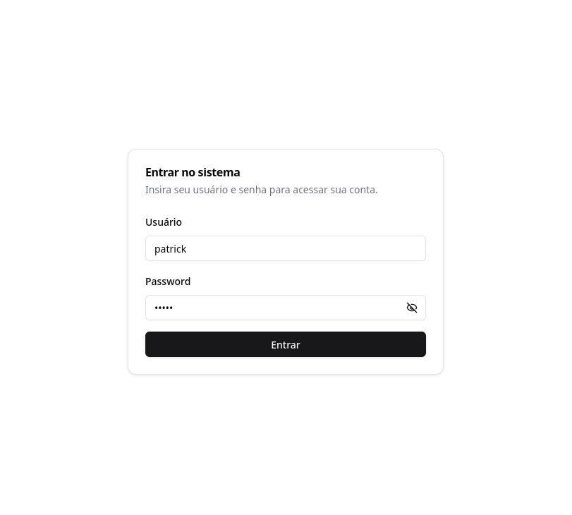
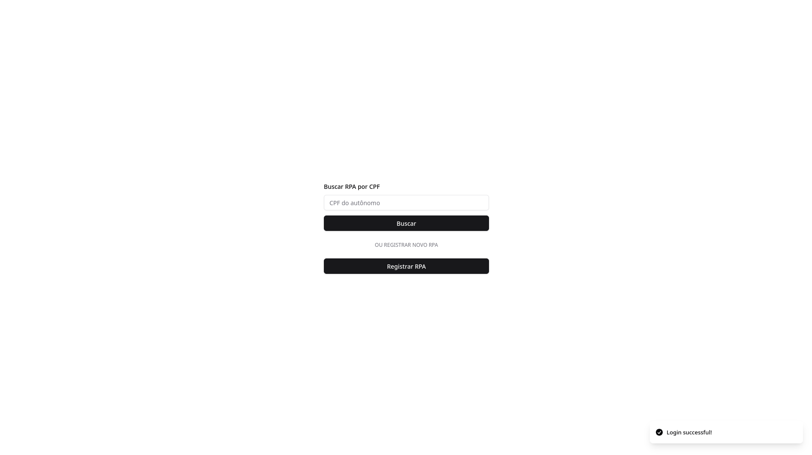
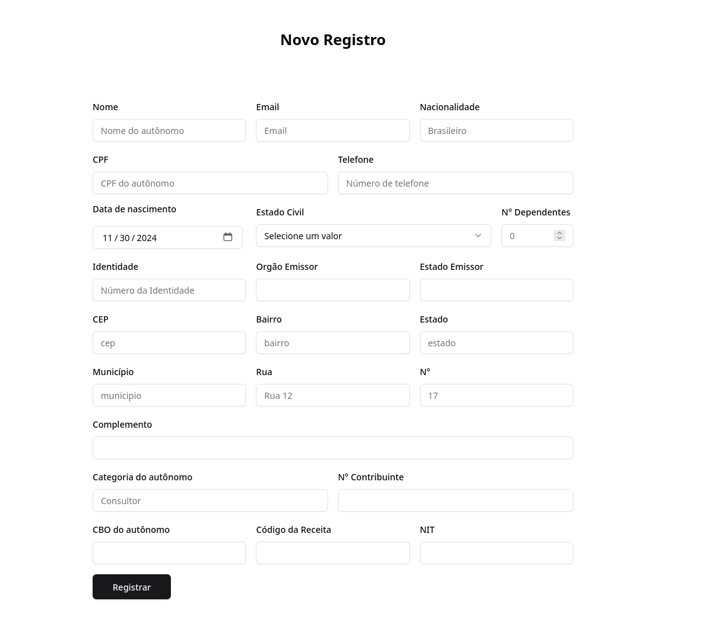
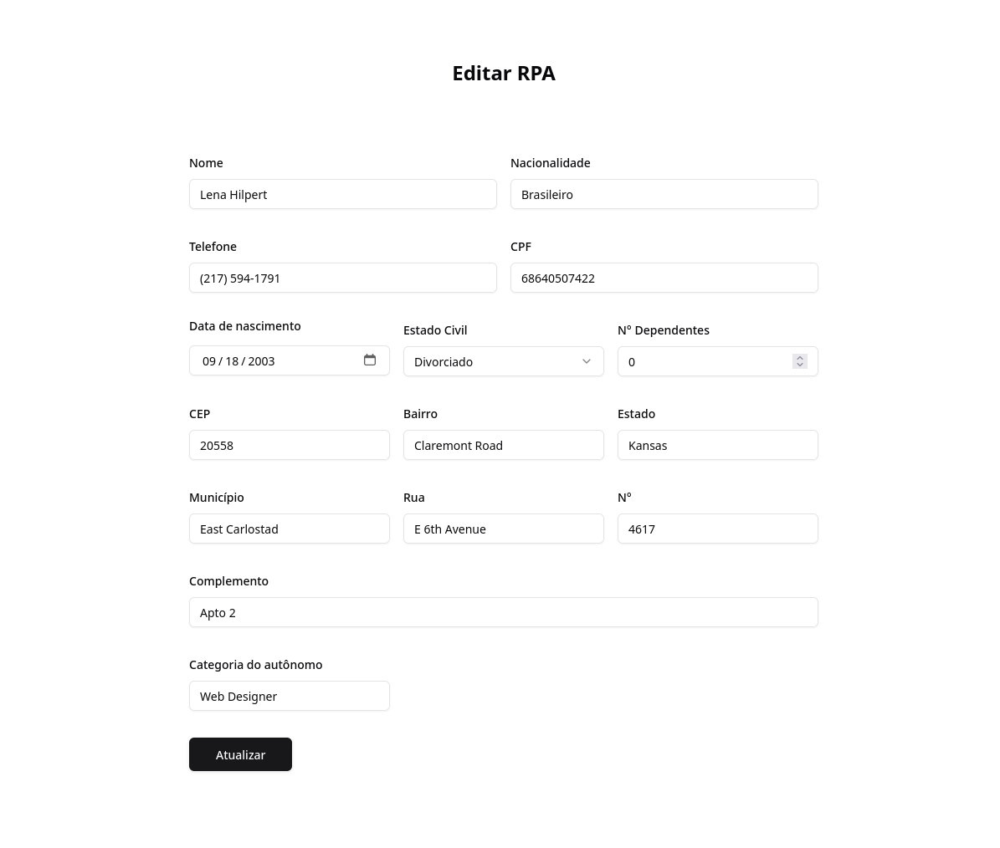

# Sistema de Login e Cadastro de Recibo de Pagamento Autônomo (RPA)

## 📋 Escopo e Objetivo do Projeto

Este projeto visa desenvolver um **Sistema de Login e Cadastro de Recibo de Pagamento Autônomo (RPA)** para a empresa *XYZ Serviços*. O objetivo principal é facilitar o gerenciamento dos profissionais autônomos que prestam serviços esporádicos à empresa, garantindo uma solução simples e eficiente para:

- **Autenticação de Usuários**: Os responsáveis pelo cadastro e consulta precisam se autenticar via login e senha criptografada.
- **Cadastro de Informações de RPA**: Permitir a criação de registros de autônomos, incluindo informações como CPF, dados de contato, e detalhes contratuais.
- **Consulta e Edição**: Os usuários poderão consultar e editar registros existentes.
- **Interface Gráfica Intuitiva**: Para garantir um uso simplificado do sistema.

Este sistema é composto por uma interface de usuário para autenticação, cadastro e consulta, um banco de dados para armazenar os registros, e fluxos bem definidos para login e gestão dos RPAs.

## 🚀 Tecnologias Utilizadas

### Frontend

- **React com TypeScript**: Utilizado para criar uma interface de usuário. A escolha do React permite maior modularidade, reutilização de componentes e uma experiência de desenvolvimento eficiente.
- **React Hook Form & Zod**: Facilita a validação de formulários e gerenciamento de estados do formulário. O `zod` foi escolhido para validações fortes de dados, garantindo que apenas informações corretas sejam submetidas.
- **React Router**: Para navegação entre diferentes páginas (login, cadastro, consulta).
- **React Query**: Simplifica a gestão de dados assíncronos, como o fetch e caching de dados.
- **Tailwind CSS**: Utilizados para estilizar a interface do usuário de forma consistente e responsiva.
- **Shadcn**: Uma biblioteca de componentes baseadas em Tailwind CSS que fornece componentes de interface de usuário comuns e extremamente customizáveis.
- **Zustand**: Uma biblioteca de gerenciamento de estado para React que simplifica a criação de aplicações de interface de usuário.

### Backend

- **Node.js com Hono.js**: Framework leve para lidar com requisições HTTP. A simplicidade do Hono se alinha com os requisitos de um sistema rápido e escalável.
- **SQLite**: Um banco de dados leve e fácil de usar, escolhido por ser adequado ao escopo do projeto.
- **Drizzle ORM**: Um ORM moderno que simplifica a interação com bancos de dados SQL. A escolha do Drizzle se dá pelo fato de suas queries serem SQL-Like, que deixa a experiência de uso mais natural, usando queries SQL.

### Segurança

- **Bcrypt**: Utilizado para criptografar as senhas, garantindo a segurança dos dados dos usuários.
- **Validação de CPF**: Antes de cadastrar ou editar qualquer registro, o CPF é validado para evitar duplicação e garantir a integridade dos dados.

## 🔧 Estrutura do Projeto

1. **Tela de Login**: Permite que o usuário se autentique no sistema utilizando nome de usuário e senha.
   

2. **Tela Principal**: Disponibiliza opções de consultar ou cadastrar um novo RPA. (Com toast de sucesso e erro)
   

3. **Tela de Cadastro**: Formulário completo para inserção dos dados de um autônomo.
   

4. **Tela de Edição**: Formulário completo para edição dos dados de um autônomo.
   

## 📈 Fluxo de Funcionamento

1. **Login**: O usuário insere as credenciais, e o sistema verifica se o usuário está cadastrado.
2. **Tela Principal**: Após o login, dois botões principais estão disponíveis:
   - **Consultar RPA**: Para buscar registros já cadastrados.
   - **Cadastrar RPA**: Para cadastrar novos registros.
3. **Cadastro de RPA**:
   - O CPF é solicitado, e o sistema verifica se já existe:
     - **CPF Existente**: Os dados são carregados para edição.
     - **Novo CPF**: Um formulário vazio é exibido.
4. **Consulta de RPA**: Insira o CPF para obter os dados de um autônomo já registrado.

## 🛠️ Melhorias Futuras

- **Autenticação por Token JWT**: Melhorar a segurança utilizando autenticação baseada em tokens JWT, facilitando sessões mais seguras.
- **Dashboard**: Criar um dashboard para exibir os dados dos RPAs cadastrados.
- **Design Responsivo Melhorado**: Melhorar ainda mais a experiência em telas menores.

## ⚙️ Como Rodar o Projeto Localmente

### Pré-requisitos

- **Node.js** (versão 20 ou superior)
- **PNPM** como gerenciador de pacotes

### Passos para Instalação

1. **Clone o Repositório**:

   ```bash
   git clone https://github.com/patricks-js/rpa-manager-challenge
   cd rpa-manager-challenge
   ```

2. **Instale as Dependências**:

   ```bash
   pnpm install
   ```

3. **Configure o Banco de Dados**:
   Rodar as migrações do Drizzle para criar as tabelas do banco de dados:

   ```bash
   pnpm db:migrate
   ```

   Esse comando cria um arquivo `sqlite.db` que será usado pelo projeto.

4. **Configurar Variáveis de Ambiente**:

   Crie um arquivo `.env.local` baseado no exemplo `.env.example` e preencha as variáveis necessárias.

5. **Rodando o projeto**:

   ```bash
   pnpm dev
   ```

6. **Acessar no Navegador**:
   O projeto deve estar disponível em `http://localhost:5173`.
